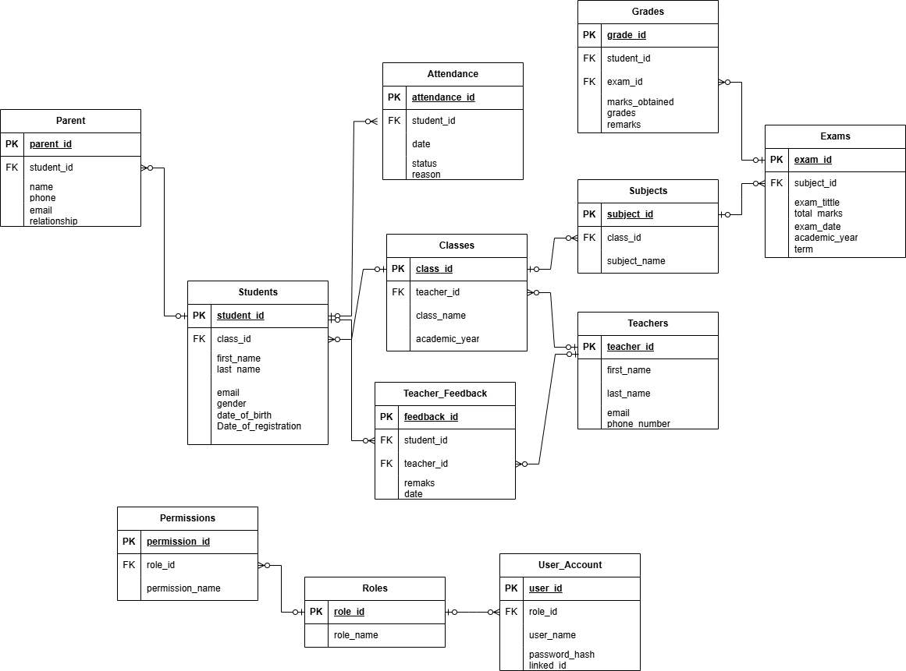

# Student Record Management System

## Description
This project is a complete database management system for tracking student records, including classes, grades, attendance, feedback, and more.

## Database ERD
Below is the Entity Relationship Diagram (ERD) for the database:



## How to Run the Project
1. Clone the repository:
   ```bash
   git clone https://github.com/FaithMonyangi/StudentsTrackingSystem_DB.git

